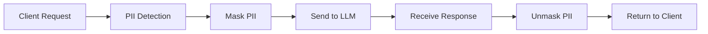

# 🛡️ LLM PII Redaction Gateway

> **Secure LLM Proxy with PII Protection for Enterprise Applications**

A production-ready proxy server that sits between your applications and Large Language Models (LLMs), automatically detecting and masking Personally Identifiable Information (PII) before sending requests to external LLM providers.

[](https://www.python.org/downloads/)
[](https://fastapi.tiangolo.com/)
[](https://opensource.org/licenses/MIT)

## 🎯 Key Features

- **🔒 Automatic PII Detection**: Detects AWS keys, passwords, IP addresses, emails, phone numbers, and more
- **🎭 Smart Masking/Unmasking**: Masks PII before sending to LLM, unmasks in responses
- **🛠️ Tool Calling Support**: Full compatibility with OpenAI tool calling and Cursor IDE
- **🌐 OpenAI Compatible API**: Drop-in replacement for OpenAI API endpoints
- **⚡ High Performance**: Async architecture with minimal latency overhead
- **🔧 Configurable**: Flexible PII patterns and security policies
- **📊 Comprehensive Logging**: Detailed audit trails and monitoring

## 🚀 Quick Start

### Installation

```bash
# Clone the repository
git clone https://github.com/VasyaLutiy/llm_pii_redaction_gateway.git
cd llm_pii_redaction_gateway

# Install dependencies
pip install -r requirements_llm_proxy.txt
```

### Configuration

1. **Set up Azure OpenAI credentials:**
```bash
cp azure.env.example azure.env
# Edit azure.env with your Azure OpenAI credentials
```

2. **Configure PII protection:**
```bash
export PII_PROTECTION_ENABLED=true
```

### Running the Server

```bash
# Start with PII protection enabled
PII_PROTECTION_ENABLED=true uvicorn llm_pii_proxy.main:create_app --factory --reload --host 0.0.0.0 --port 8000

# Start without PII protection (development)
PII_PROTECTION_ENABLED=false uvicorn llm_pii_proxy.main:create_app --factory --reload --host 0.0.0.0 --port 8000
```

## 📋 Usage Examples

### Basic Chat Request

```bash
curl -X POST "http://localhost:8000/v1/chat/completions" \
  -H "Content-Type: application/json" \
  -H "Authorization: Bearer your-api-key" \
  -d '{
    "model": "gpt-4",
    "messages": [
      {"role": "user", "content": "My AWS key is AKIAEXAMPLE12345678"}
    ],
    "pii_protection": true
  }'
```

### Tool Calling with PII Protection

```bash
curl -X POST "http://localhost:8000/v1/chat/completions" \
  -H "Content-Type: application/json" \
  -H "Authorization: Bearer your-api-key" \
  -d '{
    "model": "gpt-4",
    "messages": [
      {"role": "user", "content": "Create a config file with my AWS key AKIAEXAMPLE12345678"}
    ],
    "pii_protection": true,
    "tools": [
      {
        "type": "function",
        "function": {
          "name": "create_file",
          "description": "Create a file with given content",
          "parameters": {
            "type": "object",
            "properties": {
              "filename": {"type": "string"},
              "content": {"type": "string"}
            },
            "required": ["filename", "content"]
          }
        }
      }
    ]
  }'
```

### Cursor IDE Integration

Add to your Cursor settings:

```json
{
  "openaiCompatible": {
    "endpoint": "http://localhost:8000/v1",
    "apiKey": "your-api-key",
    "model": "gpt-4"
  }
}
```

## 🔧 Configuration

### Environment Variables

| Variable | Default | Description |
|----------|---------|-------------|
| `PII_PROTECTION_ENABLED` | `false` | Enable/disable PII protection globally |
| `PII_PROXY_DEBUG` | `false` | Enable detailed debug logging |
| `PII_SESSION_TIMEOUT_MINUTES` | `60` | PII session timeout in minutes |
| `AZURE_OPENAI_ENDPOINT` | - | Azure OpenAI endpoint URL |
| `AZURE_OPENAI_API_KEY` | - | Azure OpenAI API key |
| `AZURE_COMPLETIONS_MODEL` | `gpt-4` | Default model to use |

### PII Patterns

The system detects the following PII types by default:

- **AWS Keys**: `AKIA[0-9A-Z]{16,20}`
- **IP Addresses**: `192.168.1.100`
- **Passwords**: Context-aware password detection
- **Email Addresses**: `user@example.com`
- **Phone Numbers**: `+1-555-123-4567`
- **Credit Cards**: `4111-1111-1111-1111`

Custom patterns can be configured in `llm_pii_proxy/config/pii_patterns.yaml`.

## 📊 How It Works



1. **Request Processing**: Incoming requests are analyzed for PII content
2. **PII Masking**: Detected PII is replaced with unique tokens (e.g., `<aws_key_abc123>`)
3. **LLM Communication**: Masked request is sent to the LLM provider
4. **Response Processing**: LLM response is received and processed
5. **PII Unmasking**: Masked tokens in the response are replaced with original PII
6. **Secure Response**: Final response is returned to the client

## 🛡️ Security Features

### PII Protection Levels

- **Global Control**: Enable/disable PII protection server-wide
- **Request-Level Control**: Per-request PII protection flags
- **Session Management**: Secure PII mapping with automatic cleanup
- **Audit Logging**: Comprehensive logging without exposing sensitive data

### Supported PII Types

| Type | Example | Pattern |
|------|---------|---------|
| AWS Access Key | `AKIAEXAMPLE12345678` | `AKIA[0-9A-Z]{16,20}` |
| IP Address | `192.168.1.100` | `\b(?:\d{1,3}\.){3}\d{1,3}\b` |
| Password | `MySecretPass123` | Context-aware detection |
| Email | `user@example.com` | RFC-compliant email regex |
| Phone | `+1-555-123-4567` | International phone formats |
| Credit Card | `4111-1111-1111-1111` | Major card formats |

## 🧪 Testing

### Run Unit Tests

```bash
python -m pytest llm_pii_proxy/tests/unit/ -v
```

### Run Integration Tests

```bash
python -m pytest llm_pii_proxy/tests/integration/ -v
```

### Test PII Detection

```bash
python test_pii_patterns_fixed.py
```

### Test HTTP API

```bash
python test_http_api_with_pii.py
```

## 📈 Performance

- **Latency Overhead**: ~100-200ms for PII processing
- **Throughput**: Tested up to 10 concurrent requests
- **Memory Usage**: Minimal memory footprint with automatic session cleanup
- **Scalability**: Async architecture supports high concurrency

## 🔍 Monitoring & Logging

### Health Check

```bash
curl http://localhost:8000/health
```

### Log Levels

- **INFO**: Request processing, PII detection results
- **DEBUG**: Detailed PII mappings, request/response content
- **ERROR**: Processing errors, security issues

### Sample Log Output

```
2025-07-06 21:37:06 | INFO | 🔒 PII protection ENABLED
2025-07-06 21:37:06 | INFO | 🔍 Found 2 PII elements
2025-07-06 21:37:06 | DEBUG | AWS key: AKIA... → <aws_key_abc123>
2025-07-06 21:37:06 | DEBUG | Password: My... → <password_def456>
2025-07-06 21:37:06 | INFO | 🔓 PII unmasking completed
```

## 🚧 Development

### Project Structure

```
llm_pii_proxy/
├── api/                    # FastAPI routes and middleware
├── config/                 # Configuration files
├── core/                   # Core models and exceptions
├── providers/              # LLM provider implementations
├── security/               # PII detection and masking
├── services/               # Business logic
└── tests/                  # Test suites
```

### Adding New PII Patterns

1. Edit `llm_pii_proxy/config/pii_patterns.yaml`
2. Add your regex pattern
3. Test with `python test_pii_patterns_fixed.py`

### Contributing

1. Fork the repository
2. Create a feature branch
3. Add tests for new functionality
4. Ensure all tests pass
5. Submit a pull request

## 📄 License

This project is licensed under the MIT License - see the [LICENSE](LICENSE) file for details.

## 🤝 Support

- **Issues**: [GitHub Issues](https://github.com/VasyaLutiy/llm_pii_redaction_gateway/issues)
- **Discussions**: [GitHub Discussions](https://github.com/VasyaLutiy/llm_pii_redaction_gateway/discussions)
- **Documentation**: See the `/llm_pii_proxy/docs` folder for detailed guides

## 🎯 Roadmap

- [ ] Support for additional LLM providers (OpenAI, Anthropic, etc.)
- [ ] Machine learning-based PII detection
- [ ] Real-time PII detection metrics
- [ ] Kubernetes deployment manifests
- [ ] Advanced audit and compliance features

---

**Built with ❤️ for secure AI applications** 